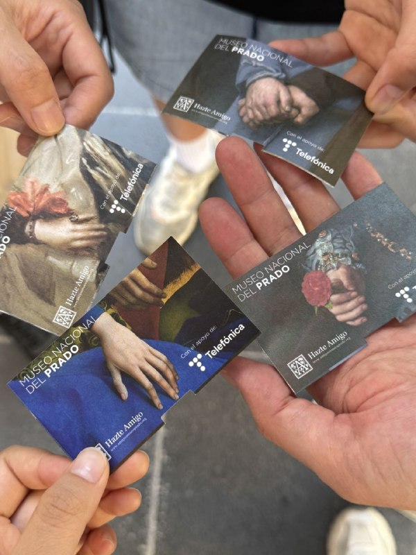
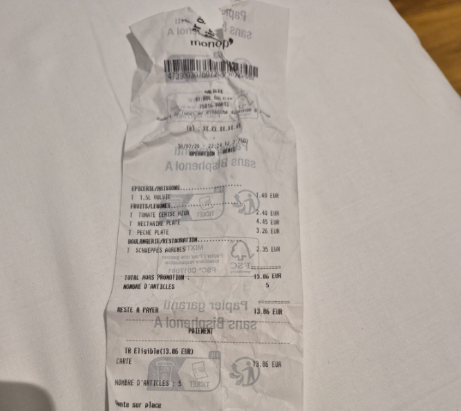

한참 바쁘게 일하고 훌쩍 떠난 2주간의 유럽 여행, gpt가 많이 도와줬다.

회사에서 하는 일도 AX이고 개인 프로젝트도 AX, 일상도 AX 그 와중에 휴가까지 AX!

*AX(AI Transformation)는 인공지능(AI)을 단순한 도구 도입을 넘어 기업의 업무 방식, 의사결정 체계, 조직 구조 전체의 중심에 두고 혁신하는 인공지능 전환을 뜻함

## 유럽 여행 아직도 책으로 준비하나?

아내가 빌려온 15권의 책을 다 읽을 수는 없었다. 4권정도 대충 봄;;

준비를 안할 수는 없고, 일정을 준비했는데, 그냥 웹 버전으로는 한계가 분명해서, Agent시켜서 파일 기반으로 리뷰하면서 만들었다.
교통 수단을 택시, 버스, 지하철, 도보 등으로 비교 정리하고, 비용과 시간 기반 추천 수단까지 정리했다.

음식은 일정 중간에 추천하는 맛집, 일정내에 메뉴가 겹치지 않게, 가능하면 현지식으로 2~3개를 조사하도록 했다.

그 외에 사전 예약이나 주의사항에 대해서도 조사해서 일정에 적어 두도록 했다.

공항에서 대기 타면서 빠르게 읽고, 전날 밤에 한 번 더 읽으니까 하루 하루 대응이 잘 되더라ㅋ

심지어 가기전에 애들 공부시키려고 사이트도 만들었는데, 실제로는 많이 안 봄;

[https://trip.msalt.net/](https://trip.msalt.net/)

## 도슨트의 종말

이번 여행에서 많이 놀란게 유럽은 아직도 시골일것 같았는데, 생각보다 많이 발전되어 있었다.

공유 전기 자전거도 있고, 대부분의 공공장소에서 와이파이가 제공된다. 그리고 현금을 하나도 안썼다.

박물관에서도 꽤나 빠른 인터넷이 제공되는데, gpt가 개인 가이드가 되어준다. 사진을 찍을 수 없는 프라도 미술관을 제외한 르부르, 오르세, 내셔널 갤러리, 영국 박물관에서 아주 유용했다.

도슨트하면 계속 질문하기 좀 그런데, 개인적으로 궁금한 것을 자꾸 캐물을 수 있어서 특히 더 좋았고, 내가 원하는 대로 루트 설계를 해서 최적 동선으로 관람이 가능하다!

## 호텔 로비 화장실 정보까지 실시간 탐색

유럽 여행에서 주의할 점은 화장실 위치인데, gpt의 실시간 탐색 능력이 빛을 발했다.

이 부분에서 아내가 가장 놀랐다. 미술관의 경우 아내는 5권 + 유튜브로 거의 가이드 수준으로 학습되었기에 내가 이길 수가 없었는데, 이건 달랐다.

딸들이 화장실을 찾을 때, 현재 내 위치에서 깔끔한 무료 화장실을 기가 막히게 찾아준다.

특히 주변 호텔 로비 뒤쪽의 화장실, 마트내에 공개 화장실을 웹에서 건물 안내도를 찾아서 알려줬을때, 살짝 자비스 같은 느낌이었다.

화장실뿐만 아니라 이상하게 생긴 건물이나 조각상, 바닥에 표시나 사람들의 옷차림까지 궁금한 모든것을 알려준다.

## 정산은 뭐 껌이지

가족 여행이니까 딱히 정산이 필요한 것은 아닌데, 어느날 보니까 아내가 영수증을 다 가지고 있더라.

오호? 재미있겠는데? 책상에 놓고 대충 다 찍어서 올렸다. 카드 이용내역도 그대로 올렸다.

도시별, 항목별 지출 정리를 촤랴락! 그래프로 주르륵~ 정산 10분컷.

생각보다 얼마 안썼네?! 다음에 또 가야지! 야외 테이블에서 샹그리아 마시면서 사람 구경하면서 수다 떨기.
